# Ballerina Playground KT Session — Illustration Pack

These diagrams are designed for your KT session slides and documentation.
You can directly copy the Mermaid diagrams into Markdown editors, GitHub, Obsidian, Notion (Mermaid enabled), or Mermaid Live Editor.

---

# 1. High-Level Playground Architecture

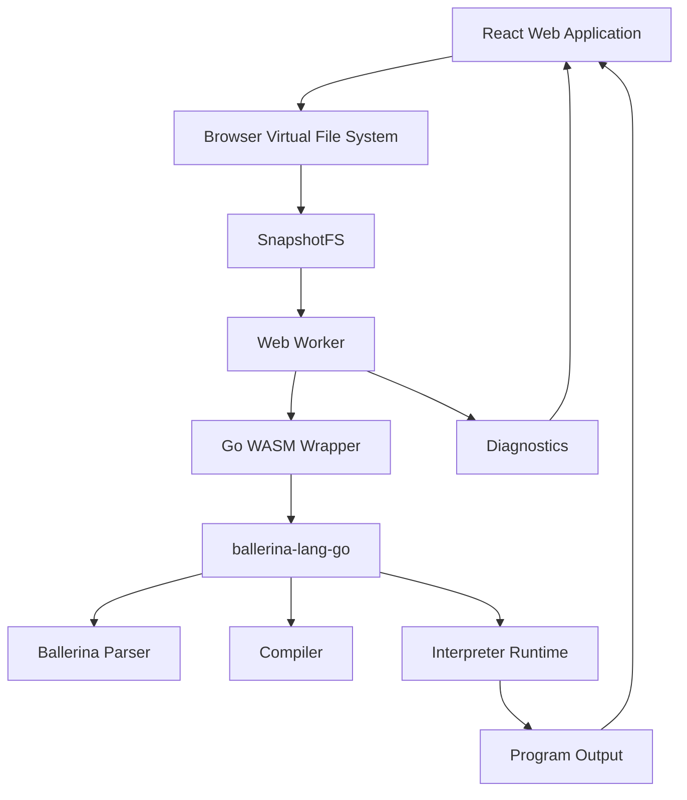

---

# 2. Repository and Package Structure

```mermaid
flowchart TB
    ROOT[Monorepo Root]

    ROOT --> WEB[@playground/web\napps/web]
    ROOT --> WASM[@playground/wasm\npackages/wasm]
    ROOT --> LANG[ballerina-lang-go\nGit Submodule]

    WEB --> WEB1[React + Vite UI]
    WEB --> WEB2[Editor]
    WEB --> WEB3[Worker Client]
    WEB --> WEB4[Browser FS]

    WASM --> WASM1[Go WASM Wrapper]
    WASM --> WASM2[FS Bridge]
    WASM --> WASM3[Platform Abstraction]

    LANG --> LANG1[Parser]
    LANG --> LANG2[Compiler]
    LANG --> LANG3[Interpreter]

    WASM --> LANG
```

---

# 3. Go WASM Thin Wrapper Architecture

```mermaid
flowchart LR
    JS[JavaScript Runtime] --> RUN[run()]
    JS --> DIAG[getDiagnostics()]

    RUN --> FS[Bridge FS]
    FS --> LOAD[projects.Load]
    LOAD --> BIR[Generate BIR]
    BIR --> RUNTIME[Create Runtime]
    RUNTIME --> EXEC[Interpret Package]

    EXEC --> OUT[stdout/stderr callback]
    OUT --> JS
```

---

# 4. Async Handling Between JavaScript and Go

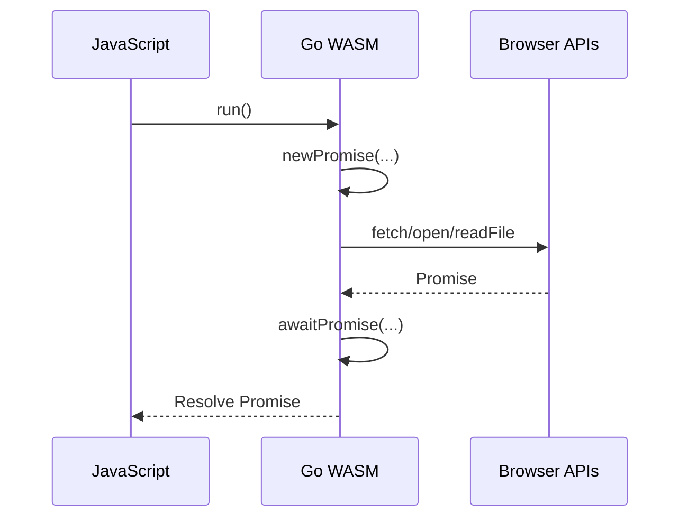

---

# 5. File System Bridge Architecture

```mermaid
flowchart LR
    A[ballerina-lang-go]
    --> B[Go bridgeFS]

    B --> C[JS FS Interface]

    C --> D[EphemeralFS]
    C --> E[LocalStorageFS]
    C --> F[LayeredFS]

    D --> G[/tmp/examples]
    D --> H[/tmp/shared]

    E --> I[/local]
```

---

# 6. Layered Filesystem Design

```mermaid
flowchart TD
    LAYER[LayeredFS]

    LAYER --> TEMP[/tmp]
    LAYER --> LOCAL[/local]

    TEMP --> EXAMPLES[/tmp/examples]
    TEMP --> SHARED[/tmp/shared]

    LOCAL --> STORAGE[Browser localStorage]

    EXAMPLES --> E1[Bundled Examples]
    SHARED --> S1[Shared Playground Files]
```

---

# 7. SnapshotFS and Worker Boundary

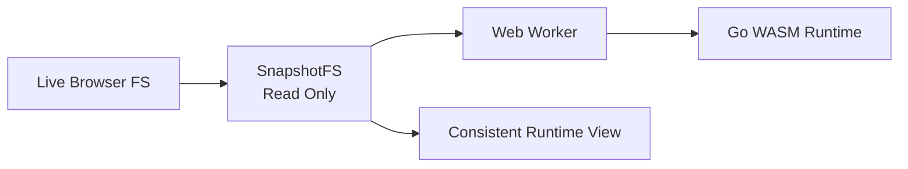

---

# 8. Web Worker Runtime Initialization

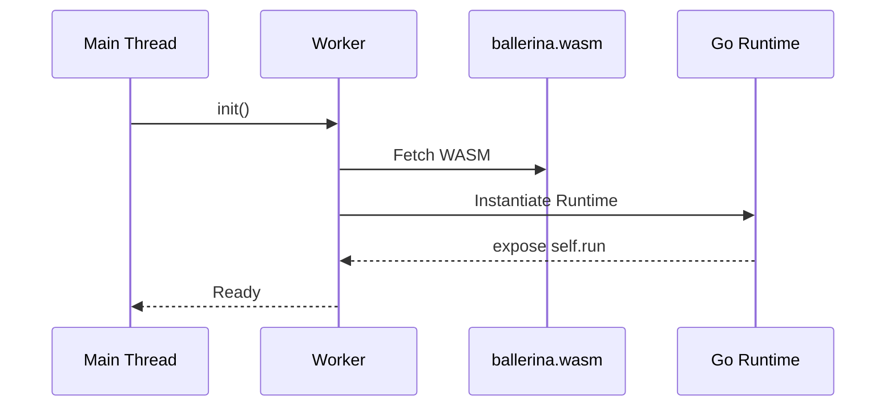

---

# 9. Ballerina Code Execution Flow

```mermaid
flowchart TD
    A[User Clicks Run]
    --> B[Save Active File]

    B --> C[Detect Project or Single File]
    C --> D[Create SnapshotFS]

    D --> E[Worker run()]
    E --> F[Go WASM run()]

    F --> G[Load Project]
    G --> H[Compile + Generate BIR]
    H --> I[Interpret Runtime]

    I --> J[Stream stdout/stderr]
    J --> K[Output Panel]
```

---

# 10. Diagnostics Flow

```mermaid
flowchart TD
    A[Editor Change]
    --> B[Save Active File]

    B --> C[Find Project Target]
    C --> D[Create SnapshotFS]

    D --> E[getDiagnostics()]
    E --> F[Compiler Diagnostics]

    F --> G[LSP-like Diagnostics]
    G --> H[CodeMirror Display]
```

---

# 11. Browser Platform Abstraction Layer

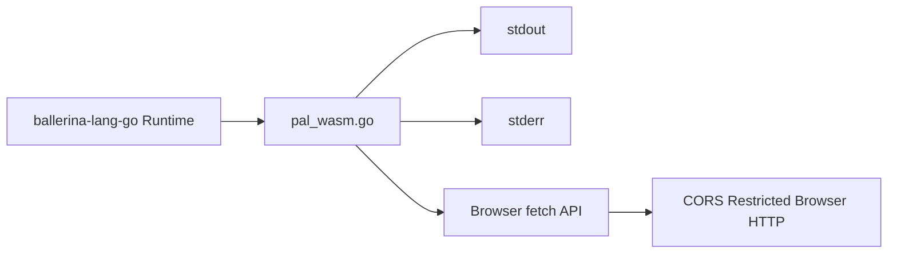

---

# 12. Sharing Flow

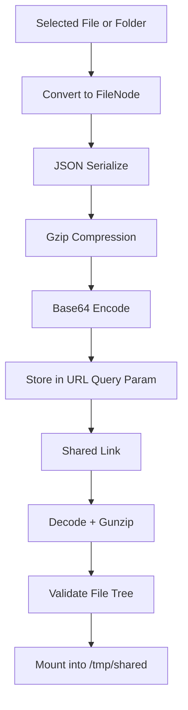

---

# 13. Example Generation Pipeline

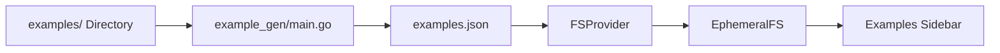

---

# 14. Routing and File Synchronization

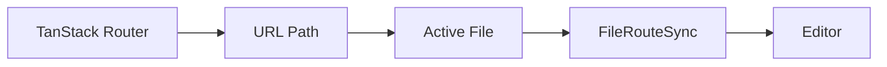

---

# 15. Version Metadata Flow

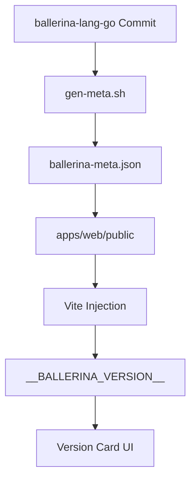

---

# 16. Turbo Build Pipeline

```mermaid
flowchart TD
    A[@playground/wasm build]
    --> B[copy:wasm]

    B --> C[apps/web/public]

    C --> D[Web Build]
    D --> E[dist/]
```

---

# 17. CI/CD Pipeline

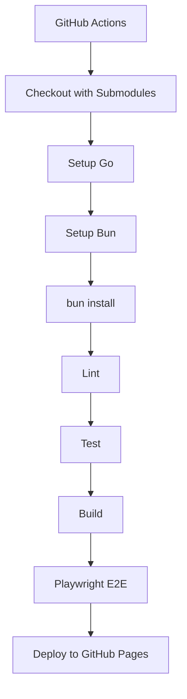

---

# 18. Current Limitations Overview

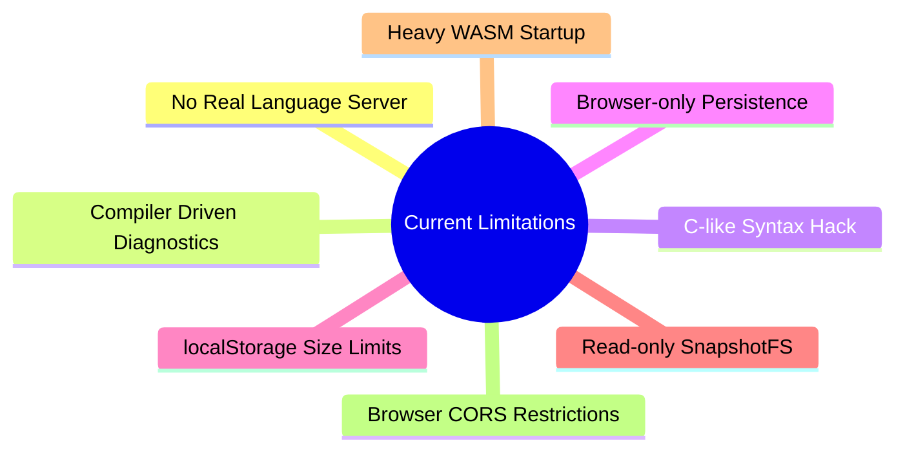

---

# 19. Recommended KT Session Flow

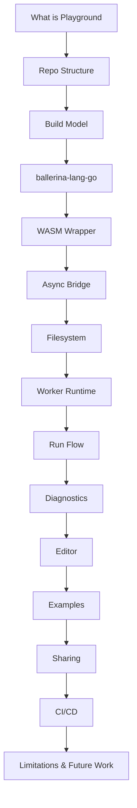
